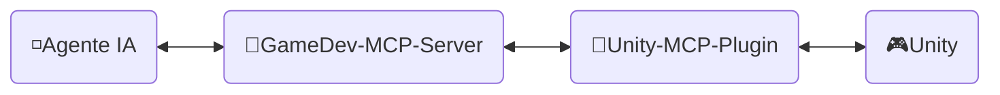
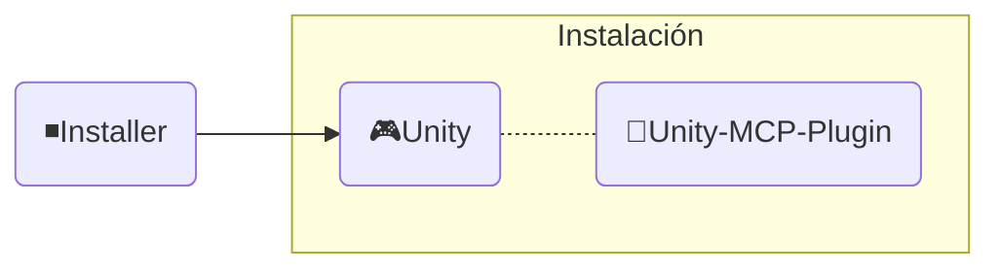

<div align="center" width="100%">
  <h1>🛠️ Desarrollo ─ Desarrollador de Juegos con IA</h1>

[](https://modelcontextprotocol.io/introduction)
[](https://openupm.com/packages/com.ivanmurzak.unity.mcp/)
[](https://hub.docker.com/r/aigamedeveloper/mcp-server)
[](https://unity.com/releases/editor/archive)
[](https://unity.com/releases/editor/archive)
[](https://github.com/IvanMurzak/Unity-MCP/actions/workflows/release.yml)</br>
[](https://discord.gg/cfbdMZX99G)
[](https://openupm.com/packages/com.ivanmurzak.unity.mcp/)
[](https://github.com/IvanMurzak/Unity-MCP/stargazers)
[](https://github.com/IvanMurzak/Unity-MCP/blob/main/LICENSE)
[](https://stand-with-ukraine.pp.ua)

  <b>[English](https://github.com/IvanMurzak/Unity-MCP/blob/main/docs/dev/Development.md) | [日本語](https://github.com/IvanMurzak/Unity-MCP/blob/main/docs/dev/Development.ja.md) | [中文](https://github.com/IvanMurzak/Unity-MCP/blob/main/docs/dev/Development.zh-CN.md)</b>

</div>

Este documento explica la estructura interna, el diseño, el estilo de código y los principios fundamentales de Unity-MCP. Úsalo si eres colaborador o deseas comprender el proyecto en profundidad.

> **[💬 Únete a nuestro servidor de Discord](https://discord.gg/cfbdMZX99G)** - ¡Haz preguntas, muestra tu trabajo y conéctate con otros desarrolladores!

## Contenido

- [Visión y Objetivos](#visión-y-objetivos)
- [Requisitos previos](#requisitos-previos)
- [Configuración del entorno local](#configuración-del-entorno-local)
- [Contribuir](#contribuir)
- [Estructura del proyecto](#estructura-del-proyecto)
  - [🔹MCP Server (shared GameDev-MCP-Server)](#mcp-server-shared-gamedev-mcp-server)
    - [Imagen Docker](#imagen-docker)
  - [🔸Unity-MCP-Plugin](#unity-mcp-plugin)
    - [Paquete UPM](#paquete-upm)
    - [Editor](#editor)
    - [Runtime](#runtime)
    - [Características MCP](#características-mcp)
      - [Añadir `MCP Tool`](#añadir-mcp-tool)
      - [Añadir `MCP Prompt`](#añadir-mcp-prompt)
  - [◾Installer (Unity)](#installer-unity)
- [Estilo de código](#estilo-de-código)
  - [Convenciones clave](#convenciones-clave)
- [Ejecutar pruebas](#ejecutar-pruebas)
  - [Ejecución local](#ejecución-local)
  - [Modos de prueba](#modos-de-prueba)
  - [Interpretación de resultados de CI](#interpretación-de-resultados-de-ci)
- [CI/CD](#cicd)
  - [Para colaboradores](#para-colaboradores)
  - [Resumen de workflows](#resumen-de-workflows)
    - [🚀 release.yml](#-releaseyml)
    - [🧪 test\_pull\_request.yml](#-test_pull_requestyml)
    - [🔧 test\_unity\_plugin.yml](#-test_unity_pluginyml)
    - [📦 deploy.yml](#-deployyml)
  - [Stack tecnológico](#stack-tecnológico)
  - [Consideraciones de seguridad](#consideraciones-de-seguridad)
  - [Destinos de despliegue](#destinos-de-despliegue)

---


# Visión y Objetivos

Creemos que la IA será (si no lo es ya) una parte importante del desarrollo de videojuegos. Existen interfaces de IA extraordinarias como `Claude`, `Copilot`, `Cursor` y muchas otras que siguen mejorando. Conectamos el desarrollo de juegos *con* estas herramientas, no en su contra — Unity MCP es una base para los sistemas de IA en el ecosistema de Unity Engine, no una ventana de chat aislada.

**Objetivos del proyecto**

- Ofrecer una solución de desarrollo de juegos con IA de alta calidad **de forma gratuita** para todos
- Proporcionar una plataforma altamente personalizable para que los desarrolladores extiendan las funciones de IA según sus necesidades
- Permitir el uso de los mejores instrumentos de IA para el desarrollo de juegos, todo en un solo lugar
- Mantener y apoyar las tecnologías de IA más avanzadas, especialmente en Unity Engine y más allá

---


# Requisitos previos

Antes de contribuir, asegúrate de tener instaladas las siguientes herramientas:

| Herramienta | Versión | Propósito |
| ---- | ------- | ------- |
| [Unity Editor](https://unity.com/releases/editor/archive) | 2022.3+ / 2023.2+ / 6000.3+ | Ejecutar y probar el plugin |
| [.NET SDK](https://dotnet.microsoft.com/download) | 9.0+ | Compilar y ejecutar el servidor MCP |
| [Node.js](https://nodejs.org/) | 18+ | Ejecutar MCP Inspector para depuración |
| PowerShell | 7+ | Ejecutar scripts de compilación y utilidades |
| Docker *(opcional)* | Latest | Compilar y probar imágenes Docker |

> Una licencia personal gratuita de Unity es suficiente para contribuir.

---


# Configuración del entorno local

1. **Clonar el repositorio**
   ```bash
   git clone https://github.com/IvanMurzak/Unity-MCP.git
   cd Unity-MCP
   ```

2. **Abrir el Plugin en Unity**
   - Abre Unity Hub → Añadir proyecto → selecciona la carpeta `Unity-MCP-Plugin/`
   - Unity compilará todos los ensamblados automáticamente al abrirlo por primera vez

3. **Obtener el MCP Server** *(vive en su propio repositorio)*
   - El servidor es el compartido [GameDev-MCP-Server](https://github.com/IvanMurzak/GameDev-MCP-Server) — clónalo por separado solo si necesitas modificar o depurar el servidor
   - El plugin descarga automáticamente el binario de release fijado por la constante `ServerVersion` en `McpServerManager.cs`

4. **Ejecutar el Servidor localmente** *(opcional — solo al desarrollar contra una build propia del servidor)*
   ```bash
   git clone https://github.com/IvanMurzak/GameDev-MCP-Server.git
   cd GameDev-MCP-Server
   dotnet run --project com.IvanMurzak.GameDev.MCP.Server.csproj -- --port 8080 --client-transport stdio
   ```

5. **Apuntar el Plugin a tu servidor local** *(opcional — omite el binario descargado automáticamente)*
   - En Unity: abre `Window/AI Game Developer — MCP`
   - Establece el puerto para que coincida con tu servidor local (`8080` por defecto)
   - El plugin se conectará automáticamente

6. **Depurar con MCP Inspector** *(opcional)*
   ```bash
   Unity-MCP-Plugin/Commands/start_mcp_inspector.bat   # Windows (.bat)
   ```
   Requiere Node.js. Abre una interfaz en el navegador en `http://localhost:5173` para la inspección en tiempo real de los mensajes del protocolo MCP.

---


# Contribuir

Construyamos juntos el brillante futuro del desarrollo de videojuegos; contribuye al proyecto. Usa este documento para entender la estructura del proyecto y cómo funciona exactamente.

1. [Haz un fork del proyecto](https://github.com/IvanMurzak/Unity-MCP/fork)
2. Realiza tus mejoras siguiendo el estilo de código
3. [Crea un Pull Request](https://github.com/IvanMurzak/Unity-MCP/compare)


# Estructura del proyecto



◽**Agente IA** - Cualquier interfaz de IA como: *Claude*, *Copilot*, *Cursor* u otras. No forma parte de este proyecto, pero es un elemento importante de la arquitectura.

🔹**GameDev-MCP-Server** - el `Servidor MCP` compartido (vive en su propio repositorio: [GameDev-MCP-Server](https://github.com/IvanMurzak/GameDev-MCP-Server)) que se conecta al `Agente IA` y opera con él. Se comunica con `Unity-MCP-Plugin` a través de SignalR. Puede ejecutarse localmente o en la nube con transporte HTTP. Stack tecnológico: `C#`, `ASP.NET Core`, `SignalR`

🔸**Unity-MCP-Plugin** - `Plugin de Unity` integrado en un proyecto Unity con acceso a la API de Unity. Se comunica con el `GameDev-MCP-Server` compartido y ejecuta comandos provenientes del servidor. Stack tecnológico: `C#`, `Unity`, `SignalR`

🎮**Unity** - Unity Engine, motor de videojuegos.

---

## 🔹MCP Server (shared GameDev-MCP-Server)

Una aplicación C# ASP.NET Core que actúa como puente entre los agentes de IA (interfaces de IA como Claude o Cursor) e instancias de Unity Editor. El servidor implementa el [Model Context Protocol](https://github.com/modelcontextprotocol) utilizando el [csharp-sdk](https://github.com/modelcontextprotocol/csharp-sdk).

> Ubicación del proyecto: el repositorio compartido [GameDev-MCP-Server](https://github.com/IvanMurzak/GameDev-MCP-Server) — un único servidor agnóstico del motor, consumido por Unity-MCP, Godot-MCP y Unreal-MCP. **Ya no forma parte de este repositorio.**

El plugin descarga el binario de release (`gamedev-mcp-server-<rid>.zip`) fijado por la constante `ServerVersion` en [McpServerManager.cs](../../Unity-MCP-Plugin/Packages/com.ivanmurzak.unity.mcp/Editor/Scripts/McpServerManager.cs). Consulta el [README de GameDev-MCP-Server](https://github.com/IvanMurzak/GameDev-MCP-Server#readme) para la arquitectura y las instrucciones de compilación.

### Imagen Docker

El servidor compartido se publica en Docker Hub como [`aigamedeveloper/mcp-server`](https://hub.docker.com/r/aigamedeveloper/mcp-server) desde el repositorio GameDev-MCP-Server.

---

## 🔸Unity-MCP-Plugin

Se integra en el entorno de Unity. Utiliza `Unity-MCP-Common` para buscar *Tools*, *Resources* y *Prompts* MCP en el código base local mediante reflexión. Se comunica con el `GameDev-MCP-Server` compartido para enviar actualizaciones sobre *Tools*, *Resources* y *Prompts* MCP. Recibe comandos del servidor y los ejecuta.

> Ubicación del proyecto: `Unity-MCP-Plugin`

### Paquete UPM

`Unity-MCP-Plugin` es un paquete UPM. La carpeta raíz del paquete se encuentra en `Unity-MCP-Plugin/Packages/com.ivanmurzak.unity.mcp` y contiene el archivo `package.json`, que se utiliza para publicar el paquete directamente desde una release de GitHub en [OpenUPM](https://openupm.com/).

> Ubicación: `Unity-MCP-Plugin/Packages/com.ivanmurzak.unity.mcp`

### Editor

El componente Editor proporciona integración con Unity Editor, implementando capacidades MCP (Tools, Prompts, Resources) y gestionando el ciclo de vida del `GameDev-MCP-Server` local.

> Ubicación: `Unity-MCP-Plugin/Packages/com.ivanmurzak.unity.mcp/Editor`

**Responsabilidades principales:**

1. **Gestión del ciclo de vida del Plugin** ([Startup.cs](../../Unity-MCP-Plugin/Packages/com.ivanmurzak.unity.mcp/Editor/Scripts/Startup.cs))
   - Se auto-inicializa al cargar Unity Editor mediante `[InitializeOnLoad]`
   - Gestiona la persistencia de la conexión a lo largo del ciclo de vida del Editor (recarga de ensamblados, transiciones de modo Play)
   - Reconexión automática tras la recarga del dominio o la salida del modo Play

2. **Gestión del binario del servidor MCP** ([McpServerManager.cs](../../Unity-MCP-Plugin/Packages/com.ivanmurzak.unity.mcp/Editor/Scripts/McpServerManager.cs))
   - Descarga y gestiona el ejecutable compartido de `GameDev-MCP-Server` desde sus releases de GitHub (fijado por la constante `ServerVersion`)
   - Selección de binario multiplataforma (Windows/macOS/Linux, x86/x64/ARM/ARM64)
   - Aplicación de compatibilidad de versiones entre el servidor y el plugin
   - Generación de configuración para agentes de IA (JSON con rutas de ejecutables y ajustes de conexión)

3. **Implementación de la API MCP** ([Scripts/API/](../../Unity-MCP-Plugin/Packages/com.ivanmurzak.unity.mcp/Editor/Scripts/API/))
   - **Tools** (50+): GameObject, Scene, Assets, Prefabs, Scripts, Components, Editor Control, Test Runner, Console, Reflection
   - **Prompts**: Plantillas predefinidas para tareas comunes de desarrollo en Unity
   - **Resources**: Acceso basado en URI a datos del Unity Editor con serialización JSON
   - Todas las operaciones se ejecutan en el hilo principal de Unity para garantizar la seguridad de hilos
   - Descubrimiento basado en atributos mediante `[AiTool]`, `[AiPrompt]`, `[AiResource]`

4. **Interfaz del Editor** ([Scripts/UI/](../../Unity-MCP-Plugin/Packages/com.ivanmurzak.unity.mcp/Editor/Scripts/UI/))
   - Ventana de configuración para la gestión de conexiones (`Window > AI Game Developer`)
   - Gestión del binario del servidor y acceso a logs mediante elementos del menú de Unity

### Runtime

El componente Runtime proporciona la infraestructura principal compartida entre los modos Editor y Runtime, gestionando la comunicación SignalR, la serialización y el acceso seguro a la API de Unity desde múltiples hilos.

> Ubicación: `Unity-MCP-Plugin/Packages/com.ivanmurzak.unity.mcp/Runtime`

**Responsabilidades principales:**

1. **Núcleo del Plugin y conexión SignalR** ([UnityMcpPlugin.cs](../../Unity-MCP-Plugin/Packages/com.ivanmurzak.unity.mcp/Runtime/UnityMcpPlugin.cs))
   - Singleton thread-safe que gestiona el ciclo de vida del plugin mediante `BuildAndStart()`
   - Descubre MCP Tools/Prompts/Resources de los ensamblados usando reflexión
   - Establece la conexión SignalR con el servidor MCP con monitoreo de estado reactivo (biblioteca R3)
   - Gestión de configuración: host, puerto, tiempo de espera, compatibilidad de versiones

2. **Dispatcher del hilo principal** ([MainThreadDispatcher.cs](../../Unity-MCP-Plugin/Packages/com.ivanmurzak.unity.mcp/Runtime/Utils/MainThreadDispatcher.cs))
   - Redirige las llamadas a la API de Unity desde hilos en segundo plano de SignalR al hilo principal de Unity
   - Ejecución basada en cola en el bucle Update de Unity
   - Fundamental para la ejecución segura de operaciones MCP

3. **Serialización de tipos Unity** ([ReflectionConverters/](../../Unity-MCP-Plugin/Packages/com.ivanmurzak.unity.mcp/Runtime/ReflectionConverters/), [JsonConverters/](../../Unity-MCP-Plugin/Packages/com.ivanmurzak.unity.mcp/Runtime/JsonConverters/))
   - Serialización JSON personalizada para tipos de Unity (GameObject, Component, Transform, Vector3, Quaternion, etc.)
   - Convierte objetos de Unity a formato de referencia (`GameObjectRef`, `ComponentRef`) con seguimiento de instanceID
   - Se integra con ReflectorNet para la introspección de objetos y la serialización de componentes
   - Proporciona esquemas JSON para las definiciones de tipos del protocolo MCP

4. **Registro y diagnósticos** ([Logger/](../../Unity-MCP-Plugin/Packages/com.ivanmurzak.unity.mcp/Runtime/Logger/), [Unity/Logs/](../../Unity-MCP-Plugin/Packages/com.ivanmurzak.unity.mcp/Runtime/Unity/Logs/))
   - Conecta Microsoft.Extensions.Logging con la consola de Unity con niveles codificados por color
   - Recopila logs de la consola de Unity para su recuperación por parte de la IA a través de MCP Tools

### Características MCP

#### Añadir `MCP Tool`

```csharp
[AiToolType]
public class Tool_GameObject
{
    [AiTool
    (
        "MyCustomTask",
        Title = "Create a new GameObject"
    )]
    [Description("Explica aquí al LLM qué es esto y cuándo debe llamarse.")]
    public string CustomTask
    (
        [Description("Explica al LLM qué es esto.")]
        string inputData
    )
    {
        // hacer cualquier cosa en un hilo en segundo plano

        return MainThread.Instance.Run(() =>
        {
            // hacer algo en el hilo principal si es necesario

            return $"[Success] Operation completed.";
        });
    }
}
```

#### Añadir `MCP Prompt`

`MCP Prompt` te permite inyectar prompts personalizados en la conversación con el LLM. Soporta dos roles de emisor: User y Assistant. Es una forma rápida de instruir al LLM para que realice tareas específicas. Puedes generar prompts usando datos personalizados, proporcionando listas o cualquier otra información relevante.

```csharp
[AiPromptType]
public static class Prompt_ScriptingCode
{
    [AiPrompt(Name = "add-event-system", Role = Role.User)]
    [Description("Implement UnityEvent-based communication system between GameObjects.")]
    public string AddEventSystem()
    {
        return "Create event system using UnityEvents, UnityActions, or custom event delegates for decoupled communication between game systems and components.";
    }
}
```

---

## ◾Installer (Unity)



**Installer** instala `Unity-MCP-Plugin` y sus dependencias como paquetes NPM en un proyecto Unity.

> Ubicación del proyecto: `Installer`

---


# Estilo de código

Este proyecto sigue patrones de codificación C# consistentes. Todo el código nuevo debe adherirse a estas convenciones.

## Convenciones clave

1. **Encabezados de archivo**: Incluir aviso de copyright en formato de comentario de caja al inicio de cada archivo
2. **Contexto nullable**: Usar `#nullable enable` para seguridad de nulos — sin nulos implícitos
3. **Atributos**: Usar `[AiTool]`, `[AiPrompt]`, `[AiResource]` para el descubrimiento MCP
4. **Clases parciales**: Dividir la funcionalidad en varios archivos (por ej., `Tool_GameObject.Create.cs`, `Tool_GameObject.Destroy.cs`)
5. **Ejecución en el hilo principal**: Envolver todas las llamadas a la API de Unity con `MainThread.Instance.Run()`
6. **Manejo de errores**: Lanzar excepciones para los errores — usar `ArgumentException` o `Exception`, nunca devolver cadenas de error
7. **Tipos de retorno**: Devolver modelos de datos tipados anotados con `[Description]` para retroalimentación estructurada a la IA
8. **Descripciones**: Anotar todas las APIs públicas y parámetros con `[Description]` para orientación de la IA
9. **Nomenclatura**: PascalCase para miembros y tipos públicos, `_camelCase` para campos privados de solo lectura
10. **Seguridad de nulos**: Usar tipos nullable (`?`) y operadores de coalescencia nula (`??`, `??=`)

El ejemplo anotado a continuación demuestra cómo funcionan estas convenciones en conjunto:

```csharp
/*
┌──────────────────────────────────────────────────────────────────┐
│  Author: Ivan Murzak (https://github.com/IvanMurzak)             │
│  Repository: GitHub (https://github.com/IvanMurzak/Unity-MCP)    │
│  Copyright (c) 2025 Ivan Murzak                                  │
│  Licensed under the Apache License, Version 2.0.                 │
│  See the LICENSE file in the project root for more information.  │
└──────────────────────────────────────────────────────────────────┘
*/

// Habilitar tipos de referencia nullable para mayor seguridad con nulos
#nullable enable

// Compilación condicional para código específico de plataforma
#if UNITY_EDITOR
using UnityEditor;
#endif

using System;
using System.ComponentModel;
using com.IvanMurzak.McpPlugin;
using AIGD;
using com.IvanMurzak.Unity.MCP.Runtime.Utils;
using UnityEngine;

namespace com.IvanMurzak.Unity.MCP.Editor.API
{
    // Usar [AiToolType] para clases de tools - habilita el descubrimiento MCP via reflexión
    [AiToolType]
    // Las clases parciales permiten dividir la implementación en múltiples archivos
    // Patrón: Un archivo por operación (por ej., GameObject.Create.cs, GameObject.Destroy.cs)
    public partial class Tool_GameObject
    {
        // Declaración de MCP Tool con metadatos basados en atributos
        [AiTool(
            "gameobject-create",                    // Identificador único del tool (kebab-case)
            Title = "GameObject / Create"           // Título legible por humanos
        )]
        // El atributo Description orienta a la IA sobre cuándo y cómo usar este tool
        [Description(@"Create a new GameObject in the scene.
Provide position, rotation, and scale to minimize subsequent operations.")]
        public CreateResult Create                   // Devolver un modelo de datos tipado, no una cadena
        (
            // Las descripciones de parámetros ayudan a la IA a entender las entradas esperadas
            [Description("Name of the new GameObject.")]
            string name,

            [Description("Parent GameObject reference. If not provided, created at scene root.")]
            GameObjectRef? parentGameObjectRef = null,  // Nullable con valor por defecto

            [Description("Transform position of the GameObject.")]
            Vector3? position = null,                    // Struct de Unity, nullable

            [Description("Transform rotation in Euler angles (degrees).")]
            Vector3? rotation = null,

            [Description("Transform scale of the GameObject.")]
            Vector3? scale = null
        )
        {
            // Validar antes de entrar al hilo principal — lanzar excepciones para errores
            if (string.IsNullOrEmpty(name))
                throw new ArgumentException("Name cannot be null or empty.", nameof(name));

            return MainThread.Instance.Run(() =>           // Todas las llamadas a la API de Unity DEBEN ejecutarse en el hilo principal
            {
                // Asignación de coalescencia nula para valores por defecto
                position ??= Vector3.zero;
                rotation ??= Vector3.zero;
                scale ??= Vector3.one;

                // Resolver padre opcional — lanzar excepción en error, no devolver cadenas
                var parentGo = default(GameObject);
                if (parentGameObjectRef?.IsValid(out _) == true)
                {
                    parentGo = parentGameObjectRef.FindGameObject(out var error);
                    if (error != null)
                        throw new ArgumentException(error, nameof(parentGameObjectRef));
                }

                // Crear GameObject usando la API de Unity
                var go = new GameObject(name);

                // Establecer padre si se proporcionó
                if (parentGo != null)
                    go.transform.SetParent(parentGo.transform, worldPositionStays: false);

                // Aplicar valores de transformación
                go.transform.localPosition = position.Value;
                go.transform.localRotation = Quaternion.Euler(rotation.Value);
                go.transform.localScale = scale.Value;

                // Marcar como modificado para el Unity Editor
                EditorUtility.SetDirty(go);

                // Devolver resultado tipado — propiedades anotadas con [Description] para la IA
                return new CreateResult
                {
                    InstanceId = go.GetInstanceID(),
                    Path       = go.GetPath(),
                    Name       = go.name,
                };
            });
        }

        // Clase de resultado tipado — datos estructurados devueltos al cliente de IA
        public class CreateResult
        {
            [Description("Instance ID of the created GameObject.")]
            public int InstanceId { get; set; }

            [Description("Hierarchy path of the created GameObject.")]
            public string? Path { get; set; }

            [Description("Name of the created GameObject.")]
            public string? Name { get; set; }
        }
    }

    // Archivo de clase parcial separado para prompts
    [AiPromptType]
    public static partial class Prompt_SceneManagement
    {
        // MCP Prompt con definición de rol (User o Assistant)
        [AiPrompt(Name = "setup-basic-scene", Role = Role.User)]
        [Description("Setup a basic scene with camera, lighting, and environment.")]
        public static string SetupBasicScene()
        {
            // Devolver texto del prompt para que lo procese la IA
            return "Create a basic Unity scene with Main Camera, Directional Light, and basic environment setup.";
        }
    }
}
```

---


# Ejecutar pruebas

Las pruebas cubren tres modos en tres versiones de Unity (2022, 2023, 6000) y dos sistemas operativos (Windows, Ubuntu) — 18 combinaciones en total.

## Ejecución local

**Unity Test Runner (GUI)**
1. Abre el proyecto `Unity-MCP-Plugin/` en Unity
2. Ve a `Window > General > Test Runner`
3. Selecciona la pestaña **EditMode** o **PlayMode**
4. Haz clic en **Run All** o selecciona pruebas específicas y usa **Run Selected**

**Script de PowerShell (línea de comandos)**
```powershell
# Ejecutar pruebas para una versión de Unity y modo específicos
.\commands\run-unity-tests.ps1 -unityVersion "6000.3.1f1" -testMode "editmode"
```

## Modos de prueba

| Modo | Qué prueba | Ubicación |
| ---- | ------------- | -------- |
| **EditMode** | Lógica de tools, serialización, utilidades del editor — sin necesidad de modo Play | `Packages/com.ivanmurzak.unity.mcp/Tests/Editor` |
| **PlayMode** | Plugin en runtime, conexión SignalR, dispatch al hilo principal | `Packages/com.ivanmurzak.unity.mcp/Tests/Runtime` |
| **Standalone** | Build de player completo con plugin embebido | Requiere un paso de build de player |

## Incluir tests de paquetes en el Test Runner (testables)

En proyectos que usan varios paquetes UPM, puedes controlar qué paquetes muestran sus tests en el Test Runner mediante el campo **`testables`** del [manifest del proyecto](https://docs.unity3d.com/Manual/upm-manifestPrj.html). Solo los paquetes listados en `testables` compilan y muestran sus tests. Añade este paquete (u otro) a `testables` en el manifest del proyecto para incluir sus tests.

**Ejemplo** — en `Packages/manifest.json`:

```json
{
  "dependencies": {
    "com.ivanmurzak.unity.mcp": "X.X.X"
  },
  "testables": [
    "com.ivanmurzak.unity.mcp"
  ]
}
```

Consulta [Unity: Añadir tests a tu paquete](https://docs.unity3d.com/Manual/cus-tests.html) y [Unity: Manifest del proyecto (testables)](https://docs.unity3d.com/Manual/upm-manifestPrj.html#testables) para la documentación completa.

## Interpretación de resultados de CI

Cada trabajo de CI se llama `test-unity-{version}-{mode}` (por ej., `test-unity-6000-3-1f1-editmode`). Cuando falla un trabajo:
1. Abre el trabajo fallido en GitHub Actions
2. Expande el paso **Unity Test Runner** para ver la salida en línea
3. Descarga el artefacto **test-results** para el informe XML completo
4. Corrige la prueba y haz push — CI se vuelve a ejecutar automáticamente

---


# CI/CD

El proyecto implementa un pipeline de CI/CD completo usando GitHub Actions con múltiples workflows que orquestan los procesos de compilación, prueba y despliegue.

## Para colaboradores

Esto es lo que necesitas saber al trabajar con CI como colaborador:

- **Los PRs de forks** requieren que un mantenedor aplique la etiqueta `ci-ok` antes de que comience la CI. Es una medida de seguridad para evitar que código no confiable acceda a los secretos.
- **No modifiques los archivos de workflow** en `.github/workflows/` en tu PR — la verificación de CI se abortará si detecta cambios en estos archivos de un colaborador no confiable.
- **Las 18 combinaciones de la matriz de pruebas deben pasar** antes de que un PR pueda fusionarse. Si tu cambio rompe solo una combinación (por ej., `2022-editmode`), ese trabajo mostrará una ✗ roja mientras los demás están en verde.
- **Re-ejecutar trabajos fallidos:** Ve al PR → pestaña **Checks** → haz clic en un trabajo fallido → **Re-run failed jobs**. Esto es útil para fallos transitorios del Unity Editor.
- **Orden de ejecución de workflows:** `test_pull_request.yml` se ejecuta en tu PR. `release.yml` solo se ejecuta después de fusionar en `main`. No necesitas activar las releases manualmente.

## Resumen de workflows

> Ubicación: `.github/workflows`

### 🚀 [release.yml](../../.github/workflows/release.yml)

**Disparador:** Push a la rama `main`
**Propósito:** Workflow principal de release que orquesta todo el proceso de publicación

**Proceso:**

1. **Verificación de versión** - Extrae la versión de [package.json](../../Unity-MCP-Plugin/Packages/com.ivanmurzak.unity.mcp/package.json) y comprueba si ya existe el tag de release
2. **Compilación del Installer de Unity** - Prueba y exporta el instalador del paquete Unity (`AI-Game-Dev-Installer.unitypackage`)
4. **Pruebas del Plugin de Unity** - Ejecuta pruebas completas en:
   - 3 versiones de Unity: `2022.3.62f3`, `2023.2.22f1`, `6000.3.1f1`
   - 3 modos de prueba: `editmode`, `playmode`, `standalone`
   - 2 sistemas operativos: `windows-latest`, `ubuntu-latest`
   - Total: **18 combinaciones en la matriz de pruebas**
5. **Creación de release** - Genera notas de versión a partir de commits y crea la release de GitHub con el tag
6. **Publicación** - Sube el paquete del instalador de Unity y el paquete UPM firmado a la release
7. **Notificación de Discord** - Envía las notas de la release formateadas al canal de Discord
8. **Despliegue** - Activa el workflow de despliegue de la CLI de npm
9. **Limpieza** - Elimina los artefactos de compilación tras la publicación exitosa

### 🧪 [test_pull_request.yml](../../.github/workflows/test_pull_request.yml)

**Disparador:** Pull requests a las ramas `main` o `dev`
**Propósito:** Valida los cambios del PR antes de fusionarlos

**Proceso:**

1. Ejecuta las mismas 18 combinaciones de la matriz de pruebas de Unity que el workflow de release
3. Todas las pruebas deben pasar antes de que el PR pueda fusionarse

### 🔧 [test_unity_plugin.yml](../../.github/workflows/test_unity_plugin.yml)

**Tipo:** Workflow reutilizable
**Propósito:** Workflow de pruebas de Unity parametrizado utilizado por los workflows de release y PR

**Características:**

- Acepta parámetros: `projectPath`, `unityVersion`, `testMode`
- Se ejecuta en matriz de sistemas operativos (Windows, Ubuntu)
- Usa Game CI Unity Test Runner con imágenes Docker personalizadas
- Implementa verificaciones de seguridad para colaboradores de PRs (requiere la etiqueta `ci-ok` para PRs no confiables)
- Aborta si los archivos de workflow son modificados en PRs
- Almacena en caché la Librería de Unity para ejecuciones posteriores más rápidas
- Sube artefactos de prueba para depuración

### 📦 [deploy.yml](../../.github/workflows/deploy.yml)

**Disparador:** Llamado por el workflow de release O dispatch manual
**Propósito:** Publica el paquete npm `unity-mcp-cli`

**Trabajos:**

**Despliegue de la CLI en npm:**

- Compila y prueba la CLI
- Publica en [npm](https://www.npmjs.com/package/unity-mcp-cli) con procedencia (provenance)

> Los despliegues del paquete NuGet del servidor MCP y de la imagen Docker se trasladaron al repositorio compartido [GameDev-MCP-Server](https://github.com/IvanMurzak/GameDev-MCP-Server) (Docker: [`aigamedeveloper/mcp-server`](https://hub.docker.com/r/aigamedeveloper/mcp-server)).


## Stack tecnológico

- **Plataforma de CI:** GitHub Actions
- **Pruebas de Unity:** [Game CI](https://game.ci/) con Unity Test Runner
- **Containerización:** Docker con compilaciones multiplataforma
- **Gestión de paquetes:** npm, OpenUPM
- **Herramientas de compilación:** .NET 9.0, scripts bash
- **Almacenamiento de artefactos:** Artefactos de GitHub Actions (temporales), GitHub Releases (permanente)

## Consideraciones de seguridad

- Licencia, correo electrónico y contraseña de Unity almacenados como secretos de GitHub
- La publicación en npm usa trusted publishing / provenance (OIDC)
- El workflow de PR incluye verificaciones de seguridad para modificaciones de archivos de workflow
- Las contribuciones de PRs no confiables requieren aprobación del mantenedor mediante la etiqueta `ci-ok`

## Destinos de despliegue

1. **GitHub Releases** - Paquete del instalador de Unity y paquete UPM firmado
2. **npm** - el paquete `unity-mcp-cli`
3. **OpenUPM** - Paquete del plugin de Unity (sincronizado automáticamente desde las releases de GitHub)


