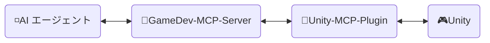
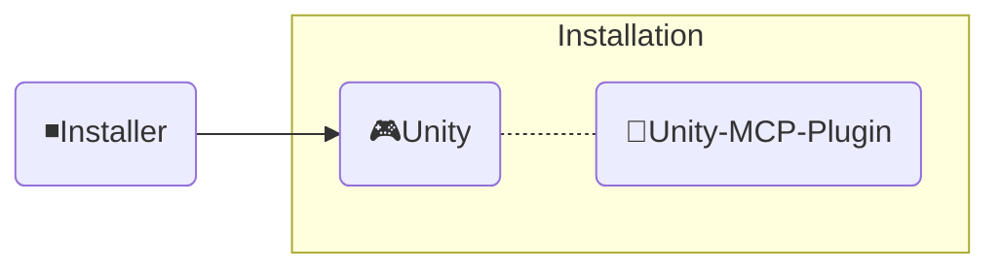

<div align="center" width="100%">
  <h1>🛠️ 開発ガイド ─ AI ゲーム開発者</h1>

[](https://modelcontextprotocol.io/introduction)
[](https://openupm.com/packages/com.ivanmurzak.unity.mcp/)
[](https://hub.docker.com/r/aigamedeveloper/mcp-server)
[](https://unity.com/releases/editor/archive)
[](https://unity.com/releases/editor/archive)
[](https://github.com/IvanMurzak/Unity-MCP/actions/workflows/release.yml)</br>
[](https://discord.gg/cfbdMZX99G)
[](https://openupm.com/packages/com.ivanmurzak.unity.mcp/)
[](https://github.com/IvanMurzak/Unity-MCP/stargazers)
[](https://github.com/IvanMurzak/Unity-MCP/blob/main/LICENSE)
[](https://stand-with-ukraine.pp.ua)

  <b>[English](https://github.com/IvanMurzak/Unity-MCP/blob/main/docs/dev/Development.md) | [Español](https://github.com/IvanMurzak/Unity-MCP/blob/main/docs/dev/Development.es.md) | [中文](https://github.com/IvanMurzak/Unity-MCP/blob/main/docs/dev/Development.zh-CN.md)</b>

</div>

このドキュメントでは、Unity-MCP の内部構造、設計、コードスタイル、および主要な原則について説明します。コントリビューターの方、またはプロジェクトを深く理解したい方はご活用ください。

> **[💬 Discord サーバーに参加](https://discord.gg/cfbdMZX99G)** - 質問したり、作品を紹介したり、他の開発者と交流しましょう！

## 目次

- [ビジョン \& ゴール](#ビジョン--ゴール)
- [前提条件](#前提条件)
- [ローカル開発環境のセットアップ](#ローカル開発環境のセットアップ)
- [コントリビュート](#コントリビュート)
- [プロジェクト構造](#プロジェクト構造)
  - [🔹MCP Server (shared GameDev-MCP-Server)](#mcp-server-shared-gamedev-mcp-server)
    - [Docker イメージ](#docker-イメージ)
  - [🔸Unity-MCP-Plugin](#unity-mcp-plugin)
    - [UPM パッケージ](#upm-パッケージ)
    - [エディター](#エディター)
    - [ランタイム](#ランタイム)
    - [MCP 機能](#mcp-機能)
      - [`MCP Tool` の追加](#mcp-tool-の追加)
      - [`MCP Prompt` の追加](#mcp-prompt-の追加)
  - [◾Installer (Unity)](#installer-unity)
- [コードスタイル](#コードスタイル)
  - [主要な規約](#主要な規約)
- [テストの実行](#テストの実行)
  - [ローカルでの実行](#ローカルでの実行)
  - [テストモード](#テストモード)
  - [CI 結果の解釈](#ci-結果の解釈)
- [CI/CD](#cicd)
  - [コントリビューター向け](#コントリビューター向け)
  - [ワークフロー概要](#ワークフロー概要)
    - [🚀 release.yml](#-releaseyml)
    - [🧪 test\_pull\_request.yml](#-test_pull_requestyml)
    - [🔧 test\_unity\_plugin.yml](#-test_unity_pluginyml)
    - [📦 deploy.yml](#-deployyml)
  - [技術スタック](#技術スタック)
  - [セキュリティに関する考慮事項](#セキュリティに関する考慮事項)
  - [デプロイ先](#デプロイ先)

---


# ビジョン & ゴール

AI はゲーム開発において重要な役割を果たしている（もしくは既にそうなっている）と私たちは考えています。`Claude`、`Copilot`、`Cursor` など、常に進化し続ける優れた AI インターフェースが存在します。私たちはゲーム開発をこれらのツールと「対立」させるのではなく「連携」させます。Unity MCP は孤立したチャットウィンドウではなく、Unity Engine エコシステムにおける AI システムの基盤です。

**プロジェクトの目標**

- 高品質な AI ゲーム開発ソリューションを全員に**無料**で提供する
- ゲーム開発者が自分のニーズに合わせて AI 機能を拡張できる高度にカスタマイズ可能なプラットフォームを提供する
- ゲーム開発に最適な AI ツールをすべて一か所で利用できるようにする
- Unity Engine を中心とした最先端の AI 技術を維持・サポートし続ける

---


# 前提条件

コントリビュートを始める前に、以下のツールがインストールされていることを確認してください：

| ツール | バージョン | 用途 |
| ---- | ------- | ------- |
| [Unity Editor](https://unity.com/releases/editor/archive) | 2022.3+ / 2023.2+ / 6000.3+ | プラグインの実行とテスト |
| [.NET SDK](https://dotnet.microsoft.com/download) | 9.0+ | MCP Server のビルドと実行 |
| [Node.js](https://nodejs.org/) | 18+ | デバッグ用 MCP Inspector の実行 |
| PowerShell | 7+ | ビルドおよびユーティリティスクリプトの実行 |
| Docker *(任意)* | 最新版 | Docker イメージのビルドとテスト |

> コントリビューションには Unity の無料 Personal ライセンスで十分です。

---


# ローカル開発環境のセットアップ

1. **リポジトリをクローンする**
   ```bash
   git clone https://github.com/IvanMurzak/Unity-MCP.git
   cd Unity-MCP
   ```

2. **Unity でプラグインを開く**
   - Unity Hub を開く → プロジェクトを追加 → `Unity-MCP-Plugin/` フォルダを選択
   - Unity は初回起動時にすべてのアセンブリを自動でコンパイルします

3. **MCP Server を入手する** *(別リポジトリにあります)*
   - サーバーは共有の [GameDev-MCP-Server](https://github.com/IvanMurzak/GameDev-MCP-Server) です — サーバー自体を変更・デバッグする場合のみ別途クローンしてください
   - プラグインは `McpServerManager.cs` の `ServerVersion` 定数で固定されたリリースバイナリを自動ダウンロードします

4. **サーバーをローカルで実行する** *(任意 — カスタムサーバービルドで開発する場合のみ)*
   ```bash
   git clone https://github.com/IvanMurzak/GameDev-MCP-Server.git
   cd GameDev-MCP-Server
   dotnet run --project com.IvanMurzak.GameDev.MCP.Server.csproj -- --port 8080 --client-transport stdio
   ```

5. **プラグインをローカルサーバーに向ける** *(任意 — 自動ダウンロードされるバイナリをスキップします)*
   - Unity で `Window/AI Game Developer (Unity-MCP)` を開く
   - ローカルサーバーのポートに合わせて設定する（デフォルトは `8080`）
   - プラグインは自動的に接続します

6. **MCP Inspector でデバッグする** *(任意)*
   ```bash
   Commands/start_mcp_inspector.bat   # Windows
   ```
   Node.js が必要です。`http://localhost:5173` にブラウザ UI が開き、MCP プロトコルメッセージをライブで確認できます。

---


# コントリビュート

一緒に輝かしいゲーム開発の未来を作りましょう。プロジェクトにコントリビュートしてください。このドキュメントを参考にプロジェクトの構造と仕組みを理解してください。

1. [プロジェクトをフォークする](https://github.com/IvanMurzak/Unity-MCP/fork)
2. 改善を加え、コードスタイルに従う
3. [プルリクエストを作成する](https://github.com/IvanMurzak/Unity-MCP/compare)


# プロジェクト構造



◽**AI エージェント** - *Claude*、*Copilot*、*Cursor* などの任意の AI インターフェースです。このプロジェクトの一部ではありませんが、アーキテクチャの重要な要素です。

🔹**GameDev-MCP-Server** - 共有の `MCP Server` です（独立リポジトリ: [GameDev-MCP-Server](https://github.com/IvanMurzak/GameDev-MCP-Server)）。`AI エージェント`に接続し、`Unity-MCP-Plugin` と SignalR を通じて通信します。ローカルまたは HTTP トランスポートを使用したクラウド上で動作可能です。技術スタック: `C#`、`ASP.NET Core`、`SignalR`

🔸**Unity-MCP-Plugin** - Unity プロジェクトに統合される `Unity Plugin` で、Unity の API にアクセスできます。共有の `GameDev-MCP-Server` と通信し、サーバーからのコマンドを実行します。技術スタック: `C#`、`Unity`、`SignalR`

🎮**Unity** - Unity Engine、ゲームエンジン。

---

## 🔹MCP Server (shared GameDev-MCP-Server)

AI エージェント（Claude、Cursor などの AI インターフェース）と Unity Editor インスタンスの間のブリッジとして機能する C# ASP.NET Core アプリケーションです。サーバーは [csharp-sdk](https://github.com/modelcontextprotocol/csharp-sdk) を使用して [Model Context Protocol](https://github.com/modelcontextprotocol) を実装しています。

> プロジェクトの場所: 共有リポジトリ [GameDev-MCP-Server](https://github.com/IvanMurzak/GameDev-MCP-Server) — Unity-MCP、Godot-MCP、Unreal-MCP が共通で利用するエンジン非依存のサーバーです。**このリポジトリには含まれなくなりました。**

プラグインは [McpServerManager.cs](../../Unity-MCP-Plugin/Packages/com.ivanmurzak.unity.mcp/Editor/Scripts/McpServerManager.cs) の `ServerVersion` 定数で固定されたリリースバイナリ（`gamedev-mcp-server-<rid>.zip`）をダウンロードします。アーキテクチャとビルド手順は [GameDev-MCP-Server README](https://github.com/IvanMurzak/GameDev-MCP-Server#readme) を参照してください。

### Docker イメージ

共有サーバーは GameDev-MCP-Server リポジトリから [`aigamedeveloper/mcp-server`](https://hub.docker.com/r/aigamedeveloper/mcp-server) として Docker Hub に公開されています。

---

## 🔸Unity-MCP-Plugin

Unity 環境に統合されます。`Unity-MCP-Common` を使用して、リフレクションによりローカルコードベースの MCP *Tool*、*Resource*、*Prompt* を検索します。MCP *Tool*、*Resource*、*Prompt* の更新情報を共有の `GameDev-MCP-Server` に送信するために通信します。サーバーからコマンドを受け取り実行します。

> プロジェクトの場所: `Unity-MCP-Plugin`

### UPM パッケージ

`Unity-MCP-Plugin` は UPM パッケージです。パッケージのルートフォルダは . にあり、`package.json` が含まれています。これは GitHub リリースから直接 [OpenUPM](https://openupm.com/) にパッケージをアップロードするために使用されます。

> 場所: `Unity-MCP-Plugin/Packages/com.ivanmurzak.unity.mcp`

### エディター

エディターコンポーネントは Unity Editor との統合を提供し、MCP 機能（Tools、Prompts、Resources）を実装し、ローカルの `GameDev-MCP-Server` のライフサイクルを管理します。

> 場所: `Unity-MCP-Plugin/Packages/com.ivanmurzak.unity.mcp/Editor`

**主な責務:**

1. **プラグインライフサイクル管理** ([Startup.cs](../../Unity-MCP-Plugin/Packages/com.ivanmurzak.unity.mcp/Editor/Scripts/Startup.cs))
   - `[InitializeOnLoad]` を通じて Unity Editor の読み込み時に自動初期化
   - エディターライフサイクルイベント（アセンブリリロード、Play モード切り替え）全体での接続持続性を管理
   - ドメインリロードまたは Play モード終了後の自動再接続

2. **MCP Server バイナリ管理** ([McpServerManager.cs](../../Unity-MCP-Plugin/Packages/com.ivanmurzak.unity.mcp/Editor/Scripts/McpServerManager.cs))
   - 共有の `GameDev-MCP-Server` 実行ファイルをその GitHub リリースからダウンロードして管理（`ServerVersion` 定数で固定）
   - クロスプラットフォームバイナリ選択（Windows/macOS/Linux、x86/x64/ARM/ARM64）
   - サーバーとプラグイン間のバージョン互換性の適用
   - AI エージェント用の設定生成（実行ファイルパスと接続設定を含む JSON）

3. **MCP API の実装** ([Scripts/API/](../../Unity-MCP-Plugin/Packages/com.ivanmurzak.unity.mcp/Editor/Scripts/API/))
   - **Tools**（50以上）: GameObject、Scene、Assets、Prefabs、Scripts、Components、エディター制御、Test Runner、Console、リフレクション
   - **Prompts**: 一般的な Unity 開発タスク用のあらかじめ構築されたテンプレート
   - **Resources**: JSON シリアライゼーションによる Unity Editor データへの URI ベースアクセス
   - スレッドセーフのため、すべての操作は Unity のメインスレッドで実行
   - `[AiTool]`、`[AiPrompt]`、`[AiResource]` を使用した属性ベースの検出

4. **エディター UI** ([Scripts/UI/](../../Unity-MCP-Plugin/Packages/com.ivanmurzak.unity.mcp/Editor/Scripts/UI/))
   - 接続管理のための設定ウィンドウ（`Window > AI Game Developer`）
   - Unity メニュー項目を通じたサーバーバイナリ管理とログアクセス

### ランタイム

ランタイムコンポーネントは、エディターとランタイムモード間で共有されるコアインフラを提供し、SignalR 通信、シリアライゼーション、スレッドセーフな Unity API アクセスを処理します。

> 場所: `Unity-MCP-Plugin/Packages/com.ivanmurzak.unity.mcp/Runtime`

**主な責務:**

1. **プラグインコア & SignalR 接続** ([UnityMcpPlugin.cs](../../Unity-MCP-Plugin/Packages/com.ivanmurzak.unity.mcp/Runtime/UnityMcpPlugin.cs))
   - `BuildAndStart()` を通じてプラグインライフサイクルを管理するスレッドセーフなシングルトン
   - リフレクションを使用してアセンブリから MCP Tools/Prompts/Resources を検出
   - リアクティブ状態モニタリング (R3 ライブラリ) を使用して MCP サーバーへの SignalR 接続を確立
   - 設定管理: ホスト、ポート、タイムアウト、バージョン互換性

2. **メインスレッドディスパッチャー** ([MainThreadDispatcher.cs](../../Unity-MCP-Plugin/Packages/com.ivanmurzak.unity.mcp/Runtime/Utils/MainThreadDispatcher.cs))
   - SignalR バックグラウンドスレッドから Unity のメインスレッドへ Unity API 呼び出しをマーシャリング
   - Unity の Update ループでのキューベース実行
   - スレッドセーフな MCP 操作実行のための重要なコンポーネント

3. **Unity 型のシリアライゼーション** ([ReflectionConverters/](../../Unity-MCP-Plugin/Packages/com.ivanmurzak.unity.mcp/Runtime/ReflectionConverters/)、[JsonConverters/](../../Unity-MCP-Plugin/Packages/com.ivanmurzak.unity.mcp/Runtime/JsonConverters/))
   - Unity 型（GameObject、Component、Transform、Vector3、Quaternion など）のカスタム JSON シリアライゼーション
   - instanceID トラッキングによる Unity オブジェクトの参照形式（`GameObjectRef`、`ComponentRef`）への変換
   - オブジェクト内省とコンポーネントシリアライゼーションのための ReflectorNet との統合
   - MCP プロトコル型定義のための JSON スキーマを提供

4. **ロギング & 診断** ([Logger/](../../Unity-MCP-Plugin/Packages/com.ivanmurzak.unity.mcp/Runtime/Logger/)、[Unity/Logs/](../../Unity-MCP-Plugin/Packages/com.ivanmurzak.unity.mcp/Runtime/Unity/Logs/))
   - Microsoft.Extensions.Logging を色分けされたレベルで Unity Console にブリッジ
   - MCP Tools を通じた AI コンテキスト取得のための Unity Console ログを収集

### MCP 機能

#### `MCP Tool` の追加

```csharp
[AiToolType]
public class Tool_GameObject
{
    [AiTool
    (
        "MyCustomTask",
        Title = "Create a new GameObject"
    )]
    [Description("LLM にこれが何であるか、いつ呼び出すべきかをここで説明します。")]
    public string CustomTask
    (
        [Description("LLM にこれが何であるかを説明します。")]
        string inputData
    )
    {
        // バックグラウンドスレッドで何でも実行できます

        return MainThread.Instance.Run(() =>
        {
            // 必要に応じてメインスレッドで何かを実行します

            return $"[Success] Operation completed.";
        });
    }
}
```

#### `MCP Prompt` の追加

`MCP Prompt` を使用すると、LLM との会話にカスタムプロンプトを注入できます。ユーザーとアシスタントの2つの送信者ロールをサポートします。これは LLM に特定のタスクを実行させるための簡単な方法です。カスタムデータを使用してプロンプトを生成し、リストやその他の関連情報を提供できます。

```csharp
[AiPromptType]
public static class Prompt_ScriptingCode
{
    [AiPrompt(Name = "add-event-system", Role = Role.User)]
    [Description("GameObject 間の UnityEvent ベースの通信システムを実装します。")]
    public string AddEventSystem()
    {
        return "Create event system using UnityEvents, UnityActions, or custom event delegates for decoupled communication between game systems and components.";
    }
}
```

---

## ◾Installer (Unity)



**Installer** は `Unity-MCP-Plugin` と依存関係を NPM パッケージとして Unity プロジェクトにインストールします。

> プロジェクトの場所: `Installer`

---


# コードスタイル

このプロジェクトは一貫した C# コーディングパターンに従います。すべての新しいコードはこれらの規約に従う必要があります。

## 主要な規約

1. **ファイルヘッダー**: すべてのファイルの先頭にボックスコメント形式で著作権表示を含める
2. **Nullable コンテキスト**: null 安全性のために `#nullable enable` を使用する — 暗黙的な null は禁止
3. **属性**: MCP 検出のために `[AiTool]`、`[AiPrompt]`、`[AiResource]` を活用する
4. **部分クラス**: 機能をファイル間に分割する（例: `Tool_GameObject.Create.cs`、`Tool_GameObject.Destroy.cs`）
5. **メインスレッド実行**: すべての Unity API 呼び出しを `MainThread.Instance.Run()` でラップする
6. **エラーハンドリング**: 例外をスローしてエラーを処理する — `ArgumentException` または `Exception` を使用し、エラー文字列を返さない
7. **戻り値の型**: `[Description]` で注釈された型付きデータモデルを返し、構造化された AI フィードバックを提供する
8. **説明**: AI ガイダンスのためにすべてのパブリック API とパラメーターに `[Description]` を付与する
9. **命名規則**: パブリックメンバーと型には PascalCase、プライベート readonly フィールドには `_camelCase`
10. **null 安全性**: nullable 型（`?`）と null 合体演算子（`??`、`??=`）を使用する

以下の注釈付きサンプルは、これらの規約がどのように連携して機能するかを示しています：

```csharp
/*
┌──────────────────────────────────────────────────────────────────┐
│  Author: Ivan Murzak (https://github.com/IvanMurzak)             │
│  Repository: GitHub (https://github.com/IvanMurzak/Unity-MCP)    │
│  Copyright (c) 2025 Ivan Murzak                                  │
│  Licensed under the Apache License, Version 2.0.                 │
│  See the LICENSE file in the project root for more information.  │
└──────────────────────────────────────────────────────────────────┘
*/

// null 安全性向上のために nullable 参照型を有効化
#nullable enable

// プラットフォーム固有のコードのための条件付きコンパイル
#if UNITY_EDITOR
using UnityEditor;
#endif

using System;
using System.ComponentModel;
using com.IvanMurzak.McpPlugin;
using AIGD;
using com.IvanMurzak.Unity.MCP.Runtime.Utils;
using UnityEngine;

namespace com.IvanMurzak.Unity.MCP.Editor.API
{
    // ツールクラスには [AiToolType] を使用 — リフレクションによる MCP 検出を有効化
    [AiToolType]
    // 部分クラスにより実装を複数ファイルに分割できます
    // パターン: 操作ごとに1ファイル（例: GameObject.Create.cs、GameObject.Destroy.cs）
    public partial class Tool_GameObject
    {
        // 属性ベースのメタデータを持つ MCP Tool の宣言
        [AiTool(
            "gameobject-create",                    // 一意のツール識別子（ケバブケース）
            Title = "GameObject / Create"           // 人が読めるタイトル
        )]
        // Description 属性は AI にこのツールをいつ/どのように使うかを案内します
        [Description(@"Create a new GameObject in the scene.
Provide position, rotation, and scale to minimize subsequent operations.")]
        public CreateResult Create                   // 文字列ではなく型付きデータモデルを返す
        (
            // パラメーターの説明は AI が期待される入力を理解するのを助けます
            [Description("Name of the new GameObject.")]
            string name,

            [Description("Parent GameObject reference. If not provided, created at scene root.")]
            GameObjectRef? parentGameObjectRef = null,  // デフォルト値付き nullable

            [Description("Transform position of the GameObject.")]
            Vector3? position = null,                    // Unity 構造体、nullable

            [Description("Transform rotation in Euler angles (degrees).")]
            Vector3? rotation = null,

            [Description("Transform scale of the GameObject.")]
            Vector3? scale = null
        )
        {
            // メインスレッドに入る前に検証 — エラーは例外としてスロー
            if (string.IsNullOrEmpty(name))
                throw new ArgumentException("Name cannot be null or empty.", nameof(name));

            return MainThread.Instance.Run(() =>           // すべての Unity API 呼び出しはメインスレッドで実行する必要があります
            {
                // デフォルト値のための null 合体代入
                position ??= Vector3.zero;
                rotation ??= Vector3.zero;
                scale ??= Vector3.one;

                // オプションの親を解決 — エラー時は例外をスロー、エラー文字列を返さない
                var parentGo = default(GameObject);
                if (parentGameObjectRef?.IsValid(out _) == true)
                {
                    parentGo = parentGameObjectRef.FindGameObject(out var error);
                    if (error != null)
                        throw new ArgumentException(error, nameof(parentGameObjectRef));
                }

                // Unity API を使用して GameObject を作成
                var go = new GameObject(name);

                // 提供されている場合は親を設定
                if (parentGo != null)
                    go.transform.SetParent(parentGo.transform, worldPositionStays: false);

                // トランスフォームの値を適用
                go.transform.localPosition = position.Value;
                go.transform.localRotation = Quaternion.Euler(rotation.Value);
                go.transform.localScale = scale.Value;

                // Unity Editor の変更としてマーク
                EditorUtility.SetDirty(go);

                // 型付き結果を返す — プロパティは AI 向けに [Description] で注釈付け
                return new CreateResult
                {
                    InstanceId = go.GetInstanceID(),
                    Path       = go.GetPath(),
                    Name       = go.name,
                };
            });
        }

        // 型付き結果クラス — AI クライアントに返す構造化データ
        public class CreateResult
        {
            [Description("Instance ID of the created GameObject.")]
            public int InstanceId { get; set; }

            [Description("Hierarchy path of the created GameObject.")]
            public string? Path { get; set; }

            [Description("Name of the created GameObject.")]
            public string? Name { get; set; }
        }
    }

    // プロンプト用の別の部分クラスファイル
    [AiPromptType]
    public static partial class Prompt_SceneManagement
    {
        // ロール定義付きの MCP Prompt（User または Assistant）
        [AiPrompt(Name = "setup-basic-scene", Role = Role.User)]
        [Description("カメラ、ライティング、環境を含む基本的なシーンをセットアップします。")]
        public static string SetupBasicScene()
        {
            // AI が処理するプロンプトテキストを返す
            return "Create a basic Unity scene with Main Camera, Directional Light, and basic environment setup.";
        }
    }
}
```

---


# テストの実行

テストは3つの Unity バージョン（2022、2023、6000）と2つの OS（Windows、Ubuntu）の組み合わせで3つのモードをカバーし、合計18の組み合わせがあります。

## ローカルでの実行

**Unity Test Runner（GUI）**
1. `Unity-MCP-Plugin/` プロジェクトを Unity で開く
2. `Window > General > Test Runner` に移動
3. **EditMode** または **PlayMode** タブを選択
4. **Run All** をクリックするか、特定のテストを選択して **Run Selected** をクリック

**PowerShell スクリプト（コマンドライン）**
```powershell
# 特定の Unity バージョンとモードのテストを実行
.\commands\run-unity-tests.ps1 -unityVersion "6000.3.1f1" -testMode "editmode"
```

## テストモード

| モード | テスト対象 | 場所 |
| ---- | ------------- | -------- |
| **EditMode** | ツールロジック、シリアライゼーション、エディターユーティリティ — Play モード不要 | `Packages/com.ivanmurzak.unity.mcp/Tests/Editor` |
| **PlayMode** | ランタイムプラグイン、SignalR 接続、メインスレッドディスパッチ | `Packages/com.ivanmurzak.unity.mcp/Tests/Runtime` |
| **Standalone** | 組み込みプラグインを含むフルプレイヤービルド | プレイヤービルドステップが必要 |

## パッケージテストを Test Runner に含める（testables）

複数の UPM パッケージを使うプロジェクトでは、[プロジェクトマニフェスト](https://docs.unity3d.com/Manual/upm-manifestPrj.html)の **`testables`** フィールドで、どのパッケージのテストを Test Runner に表示するか制御できます。`testables` に列挙したパッケージのみ、テストがコンパイル・表示されます。プロジェクトマニフェストの `testables` に本パッケージ（または他のパッケージ）を追加すると、そのテストが含まれます。

**例** — `Packages/manifest.json` で：

```json
{
  "dependencies": {
    "com.ivanmurzak.unity.mcp": "X.X.X"
  },
  "testables": [
    "com.ivanmurzak.unity.mcp"
  ]
}
```

詳細は [Unity: パッケージにテストを追加](https://docs.unity3d.com/Manual/cus-tests.html) と [Unity: プロジェクトマニフェスト（testables）](https://docs.unity3d.com/Manual/upm-manifestPrj.html#testables) を参照してください。

## CI 結果の解釈

各 CI ジョブは `test-unity-{version}-{mode}` という名前です（例: `test-unity-6000-3-1f1-editmode`）。ジョブが失敗した場合:
1. GitHub Actions で失敗したジョブを開く
2. **Unity Test Runner** ステップを展開してインライン出力を確認
3. 完全な XML レポートのために **test-results** アーティファクトをダウンロード
4. テストを修正してプッシュ — CI は自動的に再実行します

---


# CI/CD

このプロジェクトは、ビルド、テスト、デプロイプロセスを調整する複数のワークフローを持つ GitHub Actions を使用した包括的な CI/CD パイプラインを実装しています。

## コントリビューター向け

コントリビューターとして CI を使用する際に知っておくべきこと:

- **フォークからの PR** は CI が開始する前にメンテナーが `ci-ok` ラベルを適用する必要があります。これは信頼できないコードがシークレットにアクセスするのを防ぐセキュリティ対策です。
- **PR 内のワークフローファイルを変更しないでください** - `.github/workflows/` 内のファイルは変更しないでください — 信頼できないコントリビューターからこれらのファイルへの変更が検出されると CI チェックは中断されます。
- **PR がマージされる前に18のテストマトリックスの組み合わせすべてが通過する必要があります**。変更が1つの組み合わせ（例: `2022-editmode`）のみを壊す場合、そのジョブは赤い ✗ を表示し、他は緑になります。
- **失敗したジョブを再実行する:** PR → **Checks** タブ → 失敗したジョブをクリック → **Re-run failed jobs**。これは一時的な Unity Editor クラッシュに役立ちます。
- **ワークフロー実行の順序:** `test_pull_request.yml` は PR 上で実行されます。`release.yml` は `main` へのマージ後にのみ実行されます。リリースを手動でトリガーする必要はありません。

## ワークフロー概要

> 場所: `.github/workflows`

### 🚀 [release.yml](../../.github/workflows/release.yml)

**トリガー:** `main` ブランチへのプッシュ
**目的:** リリースプロセス全体を調整するメインリリースワークフロー

**プロセス:**

1. **バージョンチェック** - [package.json](../../Unity-MCP-Plugin/Packages/com.ivanmurzak.unity.mcp/package.json) からバージョンを抽出し、リリースタグが既に存在するかどうかを確認
2. **Unity Installer のビルド** - Unity パッケージインストーラーをテストしてエクスポート（`AI-Game-Dev-Installer.unitypackage`）
4. **Unity プラグインテスト** - 以下の組み合わせで包括的なテストを実行:
   - 3種類の Unity バージョン: `2022.3.62f3`、`2023.2.22f1`、`6000.3.1f1`
   - 3種類のテストモード: `editmode`、`playmode`、`standalone`
   - 2種類の OS: `windows-latest`、`ubuntu-latest`
   - 合計: **18のテストマトリックスの組み合わせ**
5. **リリース作成** - コミットからリリースノートを生成し、タグ付きで GitHub リリースを作成
6. **パブリッシング** - Unity インストーラーパッケージと署名済み UPM パッケージをリリースにアップロード
7. **Discord 通知** - フォーマットされたリリースノートを Discord チャンネルに送信
8. **デプロイ** - npm CLI のデプロイワークフローをトリガー
9. **クリーンアップ** - 正常なパブリッシング後にビルドアーティファクトを削除

### 🧪 [test_pull_request.yml](../../.github/workflows/test_pull_request.yml)

**トリガー:** `main` または `dev` ブランチへのプルリクエスト
**目的:** マージ前に PR の変更を検証

**プロセス:**

1. リリースワークフローと同じ18の Unity テストマトリックスの組み合わせを実行
3. PR がマージされる前にすべてのテストが通過する必要があります

### 🔧 [test_unity_plugin.yml](../../.github/workflows/test_unity_plugin.yml)

**タイプ:** 再利用可能なワークフロー
**目的:** リリースと PR ワークフローの両方で使用されるパラメーター化された Unity テストワークフロー

**機能:**

- パラメーターを受け入れる: `projectPath`、`unityVersion`、`testMode`
- OS のマトリックス（Windows、Ubuntu）で実行
- カスタム Docker イメージを使用した Game CI Unity Test Runner を使用
- PR コントリビューター向けのセキュリティチェックを実装（信頼できない PR には `ci-ok` ラベルが必要）
- PR でワークフローファイルが変更された場合に中断
- 以降の実行を高速化するために Unity Library をキャッシュ
- デバッグのためにテストアーティファクトをアップロード

### 📦 [deploy.yml](../../.github/workflows/deploy.yml)

**トリガー:** リリースワークフローからの呼び出し、または手動ディスパッチ
**目的:** `unity-mcp-cli` npm パッケージを公開

**ジョブ:**

**CLI を npm にデプロイ:**

- CLI をビルドしてテスト
- provenance 付きで [npm](https://www.npmjs.com/package/unity-mcp-cli) に公開

> MCP Server の NuGet パッケージと Docker イメージのデプロイは共有リポジトリ [GameDev-MCP-Server](https://github.com/IvanMurzak/GameDev-MCP-Server) に移動しました（Docker: [`aigamedeveloper/mcp-server`](https://hub.docker.com/r/aigamedeveloper/mcp-server)）。


## 技術スタック

- **CI プラットフォーム:** GitHub Actions
- **Unity テスト:** [Game CI](https://game.ci/) と Unity Test Runner
- **コンテナ化:** マルチプラットフォームビルドを持つ Docker
- **パッケージ管理:** npm、OpenUPM
- **ビルドツール:** .NET 9.0、bash スクリプト
- **アーティファクトストレージ:** GitHub Actions アーティファクト（一時的）、GitHub Releases（永続的）

## セキュリティに関する考慮事項

- Unity ライセンス、メール、パスワードは GitHub シークレットとして保存
- npm への公開には trusted publishing / provenance（OIDC）を使用
- PR ワークフローにはワークフローファイル変更のセーフティチェックを含む
- 信頼できない PR コントリビューションは `ci-ok` ラベルによるメンテナーの承認が必要

## デプロイ先

1. **GitHub Releases** - Unity インストーラーパッケージと署名済み UPM パッケージ
2. **npm** - `unity-mcp-cli` パッケージ
3. **OpenUPM** - Unity プラグインパッケージ（GitHub リリースから自動同期）


