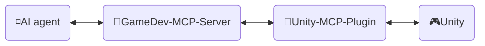
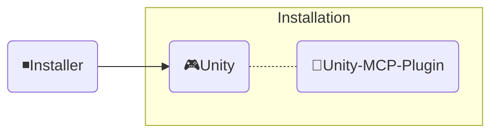

<div align="center" width="100%">
  <h1>🛠️ Development ─ AI Game Developer</h1>

[](https://modelcontextprotocol.io/introduction)
[](https://openupm.com/packages/com.ivanmurzak.unity.mcp/)
[](https://hub.docker.com/r/aigamedeveloper/mcp-server)
[](https://unity.com/releases/editor/archive)
[](https://unity.com/releases/editor/archive)
[](https://github.com/IvanMurzak/Unity-MCP/actions/workflows/release.yml)</br>
[](https://discord.gg/cfbdMZX99G)
[](https://openupm.com/packages/com.ivanmurzak.unity.mcp/)
[](https://github.com/IvanMurzak/Unity-MCP/stargazers)
[](https://github.com/IvanMurzak/Unity-MCP/blob/main/LICENSE)
[](https://stand-with-ukraine.pp.ua)

  <b>[中文](https://github.com/IvanMurzak/Unity-MCP/blob/main/docs/dev/Development.zh-CN.md) | [日本語](https://github.com/IvanMurzak/Unity-MCP/blob/main/docs/dev/Development.ja.md) | [Español](https://github.com/IvanMurzak/Unity-MCP/blob/main/docs/dev/Development.es.md)</b>

</div>

This document explains the internal structure, design, code style, and main principles of Unity-MCP. Use it if you are a contributor or want to understand the project in depth.

> **[💬 Join our Discord Server](https://discord.gg/cfbdMZX99G)** - Ask questions, showcase your work, and connect with other developers!

## Contents

- [Vision \& Goals](#vision--goals)
- [Prerequisites](#prerequisites)
- [Local Development Setup](#local-development-setup)
- [Contribute](#contribute)
- [Projects structure](#projects-structure)
  - [🔹MCP Server (shared GameDev-MCP-Server)](#mcp-server-shared-gamedev-mcp-server)
    - [Docker Image](#docker-image)
  - [🔸Unity-MCP-Plugin](#unity-mcp-plugin)
    - [UPM Package](#upm-package)
    - [Editor](#editor)
    - [Runtime](#runtime)
    - [MCP features](#mcp-features)
      - [Add `MCP Tool`](#add-mcp-tool)
      - [Add `MCP Prompt`](#add-mcp-prompt)
  - [◾Installer (Unity)](#installer-unity)
- [Code Style](#code-style)
  - [Key Conventions](#key-conventions)
- [Running Tests](#running-tests)
  - [Running locally](#running-locally)
  - [Test modes](#test-modes)
  - [Interpreting CI results](#interpreting-ci-results)
- [CI/CD](#cicd)
  - [For Contributors](#for-contributors)
  - [Workflows Overview](#workflows-overview)
    - [🚀 release.yml](#-releaseyml)
    - [🧪 test\_pull\_request.yml](#-test_pull_requestyml)
    - [🔧 test\_unity\_plugin.yml](#-test_unity_pluginyml)
    - [📦 deploy.yml](#-deployyml)
  - [Technology Stack](#technology-stack)
  - [Security Considerations](#security-considerations)
  - [Deployment Targets](#deployment-targets)

---


# Vision & Goals

We believe that AI will be (if not already) an important part of game development. There are amazing AI interfaces such as `Claude`, `Copilot`, `Cursor` and many others that keep improving. We connect game development *with* these tools, not against them — Unity MCP is a foundation for AI systems in the Unity Engine ecosystem, not an isolated chat window.

**Project goals**

- Deliver a high quality AI game development solution for **free** to everyone
- Provide a highly customizable platform for game developers to extend AI features for their needs
- Allow utilization of the best AI instruments for game development, all in one place
- Maintain and support cutting-edge AI technologies especially in Unity Engine and beyond

---


# Prerequisites

Before contributing, ensure the following tools are installed:

| Tool | Version | Purpose |
| ---- | ------- | ------- |
| [Unity Editor](https://unity.com/releases/editor/archive) | 2022.3+ / 2023.2+ / 6000.3+ | Run and test the plugin |
| [.NET SDK](https://dotnet.microsoft.com/download) | 9.0+ | Build and run the MCP Server |
| [Node.js](https://nodejs.org/) | 18+ | Run MCP Inspector for debugging |
| PowerShell | 7+ | Execute build and utility scripts |
| Docker *(optional)* | Latest | Build and test Docker images |

> A free Unity Personal license works for contribution.

---


# Local Development Setup

1. **Clone the repository**
   ```bash
   git clone https://github.com/IvanMurzak/Unity-MCP.git
   cd Unity-MCP
   ```

2. **Open the Plugin in Unity**
   - Open Unity Hub → Add project → select the `Unity-MCP-Plugin/` folder
   - Unity will compile all assemblies automatically on first open

3. **Get the MCP Server** *(lives in its own repo)*
   - The server is the shared [GameDev-MCP-Server](https://github.com/IvanMurzak/GameDev-MCP-Server) — clone it separately if you need to modify or debug the server itself
   - The plugin auto-downloads the release binary pinned by the `ServerVersion` constant in `McpServerManager.cs`, so for plugin-only development nothing is needed here

4. **Run the Server locally** *(optional — only when developing against a custom server build)*
   ```bash
   git clone https://github.com/IvanMurzak/GameDev-MCP-Server.git
   cd GameDev-MCP-Server
   dotnet run --project com.IvanMurzak.GameDev.MCP.Server.csproj -- --port 8080 --client-transport stdio
   ```

5. **Point the Plugin at your local server** *(optional — skips the auto-downloaded binary)*
   - In Unity: open `Window/AI Game Developer — MCP`
   - Set the port to match your local server (`8080` by default)
   - The plugin will connect automatically

6. **Debug with MCP Inspector** *(optional)*
   ```bash
   Unity-MCP-Plugin/Commands/start_mcp_inspector.bat   # Windows (.bat)
   ```
   Requires Node.js. Opens a browser UI at `http://localhost:5173` for live inspection of MCP protocol messages.

---


# Contribute

Lets build the bright game development future together, contribute to the project. Use this document to understand the project structure and how exactly it works.

1. [Fork the project](https://github.com/IvanMurzak/Unity-MCP/fork)
2. Make your improvements, follow code style
3. [Create Pull Request](https://github.com/IvanMurzak/Unity-MCP/compare)


# Projects structure



◽**AI agent** - Any AI interface such as: *Claude*, *Copilot*, *Cursor* or any other, it is not part of these project, but it is an important element of the architecture.

🔹**GameDev-MCP-Server** - the shared `MCP Server` (lives in its own repo: [GameDev-MCP-Server](https://github.com/IvanMurzak/GameDev-MCP-Server)) that connects to the `AI agent` and operates with it. It communicates with `Unity-MCP-Plugin` over SignalR. May run locally or in a cloud with HTTP transport. Tech stack: `C#`, `ASP.NET Core`, `SignalR`

🔸**Unity-MCP-Plugin** - `Unity Plugin` which is integrated into a Unity project, has access to Unity's API. Communicates with the shared `GameDev-MCP-Server` and executes commands from the server. Tech stack: `C#`, `Unity`, `SignalR`

🎮**Unity** - Unity Engine, game engine.

---

## 🔹MCP Server (shared GameDev-MCP-Server)

A C# ASP.NET Core application that acts as a bridge between AI agents (AI interfaces like Claude, Cursor) and Unity Editor instances. The server implements the [Model Context Protocol](https://github.com/modelcontextprotocol) using the [csharp-sdk](https://github.com/modelcontextprotocol/csharp-sdk).

> Project location: the shared [GameDev-MCP-Server](https://github.com/IvanMurzak/GameDev-MCP-Server) repository — one engine-agnostic server consumed by Unity-MCP, Godot-MCP, and Unreal-MCP. It is **no longer part of this repo**.

**Main Responsibilities** (see the [GameDev-MCP-Server README](https://github.com/IvanMurzak/GameDev-MCP-Server#readme) for details):

1. **MCP Protocol Implementation** — Tools, Prompts, and Resources over STDIO and HTTP transports
2. **SignalR Hub Communication** — real-time bidirectional communication with the engine plugin, including the version handshake
3. **Request Routing & Execution** — routes AI agent requests to the connected plugin instance
4. **Remote Execution Service** — async request/response with timeouts and cancellation
5. **Server Lifecycle Management** — Kestrel hosting, NLog logging, graceful shutdown

The plugin downloads the release binary (`gamedev-mcp-server-<rid>.zip`) pinned by the `ServerVersion` constant in [McpServerManager.cs](../../Unity-MCP-Plugin/Packages/com.ivanmurzak.unity.mcp/Editor/Scripts/McpServerManager.cs). Bumping the consumed server = changing that constant; the corresponding `v<ServerVersion>` release must already exist on GameDev-MCP-Server.

### Docker Image

The shared server is published to Docker Hub as [`aigamedeveloper/mcp-server`](https://hub.docker.com/r/aigamedeveloper/mcp-server) from the GameDev-MCP-Server repo.

---

## 🔸Unity-MCP-Plugin

Integrates into Unity environment. Uses `Unity-MCP-Common` for searching for MCP *Tool*, *Resource* and *Prompt* in the local codebase using reflection. Communicates with the shared `GameDev-MCP-Server` for sending updates about MCP *Tool*, *Resource* and *Prompt*. Takes commands from the server and executes it.

> Project location: `Unity-MCP-Plugin`

### UPM Package

`Unity-MCP-Plugin` is a UPM package, the root folder of the package is located at . It contains `package.json`. Which is used for uploading the package directly from GitHub release to [OpenUPM](https://openupm.com/).

> Location `Unity-MCP-Plugin/Packages/com.ivanmurzak.unity.mcp`

### Editor

The Editor component provides Unity Editor integration, implementing MCP capabilities (Tools, Prompts, Resources) and managing the local `GameDev-MCP-Server` lifecycle.

> Location `Unity-MCP-Plugin/Packages/com.ivanmurzak.unity.mcp/Editor`

**Main Responsibilities:**

1. **Plugin Lifecycle Management** ([Startup.cs](../../Unity-MCP-Plugin/Packages/com.ivanmurzak.unity.mcp/Editor/Scripts/Startup.cs))
   - Auto-initializes on Unity Editor load via `[InitializeOnLoad]`
   - Manages connection persistence across Editor lifecycle events (assembly reload, play mode transitions)
   - Automatic reconnection after domain reload or Play mode exit

2. **MCP Server Binary Management** ([McpServerManager.cs](../../Unity-MCP-Plugin/Packages/com.ivanmurzak.unity.mcp/Editor/Scripts/McpServerManager.cs))
   - Downloads and manages the shared `GameDev-MCP-Server` executable from its GitHub releases (pinned by the `ServerVersion` constant)
   - Cross-platform binary selection (Windows/macOS/Linux, x86/x64/ARM/ARM64)
   - Version compatibility enforcement between server and plugin
   - Configuration generation for AI agents (JSON with executable paths and connection settings)

3. **MCP API Implementation** ([Scripts/API/](../../Unity-MCP-Plugin/Packages/com.ivanmurzak.unity.mcp/Editor/Scripts/API/))
   - **Tools** (50+): GameObject, Scene, Assets, Prefabs, Scripts, Components, Editor Control, Test Runner, Console, Reflection
   - **Prompts**: Pre-built templates for common Unity development tasks
   - **Resources**: URI-based access to Unity Editor data with JSON serialization
   - All operations execute on Unity's main thread for thread safety
   - Attribute-based discovery using `[AiTool]`, `[AiPrompt]`, `[AiResource]`

4. **Editor UI** ([Scripts/UI/](../../Unity-MCP-Plugin/Packages/com.ivanmurzak.unity.mcp/Editor/Scripts/UI/))
   - Configuration window for connection management (`Window > AI Game Developer`)
   - Server binary management and log access via Unity menu items

### Runtime

The Runtime component provides core infrastructure shared between Editor and Runtime modes, handling SignalR communication, serialization, and thread-safe Unity API access.

> Location `Unity-MCP-Plugin/Packages/com.ivanmurzak.unity.mcp/Runtime`

**Main Responsibilities:**

1. **Plugin Core & SignalR Connection** ([UnityMcpPlugin.cs](../../Unity-MCP-Plugin/Packages/com.ivanmurzak.unity.mcp/Runtime/UnityMcpPlugin.cs))
   - Thread-safe singleton managing plugin lifecycle via `BuildAndStart()`
   - Discovers MCP Tools/Prompts/Resources from assemblies using reflection
   - Establishes SignalR connection to the MCP server with reactive state monitoring (R3 library)
   - Configuration management: host, port, timeout, version compatibility

2. **Main Thread Dispatcher** ([MainThreadDispatcher.cs](../../Unity-MCP-Plugin/Packages/com.ivanmurzak.unity.mcp/Runtime/Utils/MainThreadDispatcher.cs))
   - Marshals Unity API calls from SignalR background threads to Unity's main thread
   - Queue-based execution in Unity's Update loop
   - Critical for thread-safe MCP operation execution

3. **Unity Type Serialization** ([ReflectionConverters/](../../Unity-MCP-Plugin/Packages/com.ivanmurzak.unity.mcp/Runtime/ReflectionConverters/), [JsonConverters/](../../Unity-MCP-Plugin/Packages/com.ivanmurzak.unity.mcp/Runtime/JsonConverters/))
   - Custom JSON serialization for Unity types (GameObject, Component, Transform, Vector3, Quaternion, etc.)
   - Converts Unity objects to reference format (`GameObjectRef`, `ComponentRef`) with instanceID tracking
   - Integrates with ReflectorNet for object introspection and component serialization
   - Provides JSON schemas for MCP protocol type definitions

4. **Logging & Diagnostics** ([Logger/](../../Unity-MCP-Plugin/Packages/com.ivanmurzak.unity.mcp/Runtime/Logger/), [Unity/Logs/](../../Unity-MCP-Plugin/Packages/com.ivanmurzak.unity.mcp/Runtime/Unity/Logs/))
   - Bridges Microsoft.Extensions.Logging to Unity Console with color-coded levels
   - Collects Unity Console logs for AI context retrieval via MCP Tools

### MCP features

#### Add `MCP Tool`

```csharp
[AiToolType]
public class Tool_GameObject
{
    [AiTool
    (
        "MyCustomTask",
        Title = "Create a new GameObject"
    )]
    [Description("Explain here to LLM what is this, when it should be called.")]
    public string CustomTask
    (
        [Description("Explain to LLM what is this.")]
        string inputData
    )
    {
        // do anything in background thread

        return MainThread.Instance.Run(() =>
        {
            // do something in main thread if needed

            return $"[Success] Operation completed.";
        });
    }
}
```

#### Add `MCP Prompt`

`MCP Prompt` allows you to inject custom prompts into the conversation with the LLM. It supports two sender roles: User and Assistant. This is a quick way to instruct the LLM to perform specific tasks. You can generate prompts using custom data, providing lists or any other relevant information.

```csharp
[AiPromptType]
public static class Prompt_ScriptingCode
{
    [AiPrompt(Name = "add-event-system", Role = Role.User)]
    [Description("Implement UnityEvent-based communication system between GameObjects.")]
    public string AddEventSystem()
    {
        return "Create event system using UnityEvents, UnityActions, or custom event delegates for decoupled communication between game systems and components.";
    }
}
```

---

## ◾Installer (Unity)



**Installer** installs `Unity-MCP-Plugin` and dependencies as an NPM packages into a Unity project.

> Project location: `Installer`

---


# Code Style

This project follows consistent C# coding patterns. All new code must adhere to these conventions.

## Key Conventions

1. **File Headers**: Include copyright notice in box comment format at the top of every file
2. **Nullable Context**: Use `#nullable enable` for null safety — no implicit nulls
3. **Attributes**: Leverage `[AiTool]`, `[AiPrompt]`, `[AiResource]` for MCP discovery
4. **Partial Classes**: Split functionality across files (e.g., `Tool_GameObject.Create.cs`, `Tool_GameObject.Destroy.cs`)
5. **Main Thread Execution**: Wrap all Unity API calls with `MainThread.Instance.Run()`
6. **Error Handling**: Throw exceptions for errors — use `ArgumentException` or `Exception`, never return error strings
7. **Return Types**: Return typed data models annotated with `[Description]` for structured AI feedback
8. **Descriptions**: Annotate all public APIs and parameters with `[Description]` for AI guidance
9. **Naming**: PascalCase for public members and types, `_camelCase` for private readonly fields
10. **Null Safety**: Use nullable types (`?`) and null-coalescing operators (`??`, `??=`)

The annotated example below demonstrates how these conventions work together:

```csharp
/*
┌──────────────────────────────────────────────────────────────────┐
│  Author: Ivan Murzak (https://github.com/IvanMurzak)             │
│  Repository: GitHub (https://github.com/IvanMurzak/Unity-MCP)    │
│  Copyright (c) 2025 Ivan Murzak                                  │
│  Licensed under the Apache License, Version 2.0.                 │
│  See the LICENSE file in the project root for more information.  │
└──────────────────────────────────────────────────────────────────┘
*/

// Enable nullable reference types for better null safety
#nullable enable

// Conditional compilation for platform-specific code
#if UNITY_EDITOR
using UnityEditor;
#endif

using System;
using System.ComponentModel;
using com.IvanMurzak.McpPlugin;
using AIGD;
using com.IvanMurzak.Unity.MCP.Runtime.Utils;
using UnityEngine;

namespace com.IvanMurzak.Unity.MCP.Editor.API
{
    // Use [AiToolType] for tool classes - enables MCP discovery via reflection
    [AiToolType]
    // Partial classes allow splitting implementation across multiple files
    // Pattern: One file per operation (e.g., GameObject.Create.cs, GameObject.Destroy.cs)
    public partial class Tool_GameObject
    {
        // MCP Tool declaration with attribute-based metadata
        [AiTool(
            "gameobject-create",                    // Unique tool identifier (kebab-case)
            Title = "GameObject / Create"           // Human-readable title
        )]
        // Description attribute guides AI on when/how to use this tool
        [Description(@"Create a new GameObject in the scene.
Provide position, rotation, and scale to minimize subsequent operations.")]
        public CreateResult Create                   // Return a typed data model, not a string
        (
            // Parameter descriptions help AI understand expected inputs
            [Description("Name of the new GameObject.")]
            string name,

            [Description("Parent GameObject reference. If not provided, created at scene root.")]
            GameObjectRef? parentGameObjectRef = null,  // Nullable with default value

            [Description("Transform position of the GameObject.")]
            Vector3? position = null,                    // Unity struct, nullable

            [Description("Transform rotation in Euler angles (degrees).")]
            Vector3? rotation = null,

            [Description("Transform scale of the GameObject.")]
            Vector3? scale = null
        )
        {
            // Validate before entering the main thread — throw exceptions for errors
            if (string.IsNullOrEmpty(name))
                throw new ArgumentException("Name cannot be null or empty.", nameof(name));

            return MainThread.Instance.Run(() =>           // All Unity API calls MUST run on main thread
            {
                // Null-coalescing assignment for default values
                position ??= Vector3.zero;
                rotation ??= Vector3.zero;
                scale ??= Vector3.one;

                // Resolve optional parent — throw on bad reference, don't return error strings
                var parentGo = default(GameObject);
                if (parentGameObjectRef?.IsValid(out _) == true)
                {
                    parentGo = parentGameObjectRef.FindGameObject(out var error);
                    if (error != null)
                        throw new ArgumentException(error, nameof(parentGameObjectRef));
                }

                // Create GameObject using Unity API
                var go = new GameObject(name);

                // Set parent if provided
                if (parentGo != null)
                    go.transform.SetParent(parentGo.transform, worldPositionStays: false);

                // Apply transform values
                go.transform.localPosition = position.Value;
                go.transform.localRotation = Quaternion.Euler(rotation.Value);
                go.transform.localScale = scale.Value;

                // Mark as modified for Unity Editor
                EditorUtility.SetDirty(go);

                // Return a typed result — properties annotated with [Description] for AI
                return new CreateResult
                {
                    InstanceId = go.GetInstanceID(),
                    Path       = go.GetPath(),
                    Name       = go.name,
                };
            });
        }

        // Typed result class — structured data returned to the AI client
        public class CreateResult
        {
            [Description("Instance ID of the created GameObject.")]
            public int InstanceId { get; set; }

            [Description("Hierarchy path of the created GameObject.")]
            public string? Path { get; set; }

            [Description("Name of the created GameObject.")]
            public string? Name { get; set; }
        }
    }

    // Separate partial class file for prompts
    [AiPromptType]
    public static partial class Prompt_SceneManagement
    {
        // MCP Prompt with role definition (User or Assistant)
        [AiPrompt(Name = "setup-basic-scene", Role = Role.User)]
        [Description("Setup a basic scene with camera, lighting, and environment.")]
        public static string SetupBasicScene()
        {
            // Return prompt text for AI to process
            return "Create a basic Unity scene with Main Camera, Directional Light, and basic environment setup.";
        }
    }
}
```

---


# Running Tests

Tests cover three modes across three Unity versions (2022, 2023, 6000) and two OSes (Windows, Ubuntu) — 18 combinations total.

## Running locally

**Unity Test Runner (GUI)**
1. Open the `Unity-MCP-Plugin/` project in Unity
2. Go to `Window > General > Test Runner`
3. Select **EditMode** or **PlayMode** tab
4. Click **Run All** or select specific tests and **Run Selected**

**PowerShell script (command line)**
```powershell
# Run tests for a specific Unity version and mode
.\commands\run-unity-tests.ps1 -unityVersion "6000.3.1f1" -testMode "editmode"
```

## Test modes

| Mode | What it tests | Location |
| ---- | ------------- | -------- |
| **EditMode** | Tool logic, serialization, editor utilities — no Play mode needed | `Packages/com.ivanmurzak.unity.mcp/Tests/Editor` |
| **PlayMode** | Runtime plugin, SignalR connection, main thread dispatch | `Packages/com.ivanmurzak.unity.mcp/Tests/Runtime` |
| **Standalone** | Full player build with embedded plugin | Requires a player build step |

## Including package tests (testables)

In projects that use multiple UPM packages, you can control which packages’ tests appear in the Test Runner via the [project manifest](https://docs.unity3d.com/Manual/upm-manifestPrj.html) **`testables`** field. Only packages listed in `testables` have their tests compiled and shown. Add this package (or any other) to `testables` in your project manifest to include its tests.

**Example** — in `Packages/manifest.json`:

```json
{
  "dependencies": {
    "com.ivanmurzak.unity.mcp": "X.X.X"
  },
  "testables": [
    "com.ivanmurzak.unity.mcp"
  ]
}
```

See [Unity: Add tests to your package](https://docs.unity3d.com/Manual/cus-tests.html) and [Unity: Project manifest (testables)](https://docs.unity3d.com/Manual/upm-manifestPrj.html#testables) for full documentation.

## Interpreting CI results

Each CI job is named `test-unity-{version}-{mode}` (e.g., `test-unity-6000-3-1f1-editmode`). When a job fails:
1. Open the failing job in GitHub Actions
2. Expand the **Unity Test Runner** step for inline output
3. Download the **test-results** artifact for the full XML report
4. Fix the test and push — CI reruns automatically

---


# CI/CD

The project implements a comprehensive CI/CD pipeline using GitHub Actions with multiple workflows orchestrating the build, test, and deployment processes.

## For Contributors

Here is what you need to know when working with CI as a contributor:

- **PRs from forks** require a maintainer to apply the `ci-ok` label before CI starts. This is a security measure to prevent untrusted code from accessing secrets.
- **Do not modify workflow files** in `.github/workflows/` in your PR — the CI check will abort if it detects changes to these files from an untrusted contributor.
- **All 18 test matrix combinations must pass** before a PR can be merged. If your change breaks only one combination (e.g., `2022-editmode`), that job will show a red ✗ while others are green.
- **Re-running failed jobs:** Go to the PR → **Checks** tab → click a failed job → **Re-run failed jobs**. This is useful for transient Unity Editor crashes.
- **Workflow run order:** `test_pull_request.yml` runs on your PR. `release.yml` runs only after merging to `main`. You don't need to trigger releases manually.

## Workflows Overview

> Location: `.github/workflows`

### 🚀 [release.yml](../../.github/workflows/release.yml)

**Trigger:** Push to `main` branch
**Purpose:** Main release workflow that orchestrates the entire release process

**Process:**

1. **Version Check** - Extracts version from [package.json](../../Unity-MCP-Plugin/Packages/com.ivanmurzak.unity.mcp/package.json) and checks if release tag already exists
2. **Build Unity Installer** - Tests and exports Unity package installer (`AI-Game-Dev-Installer.unitypackage`)
3. **Unity Plugin Testing** - Runs comprehensive tests across:
   - 3 Unity versions: `2022.3.62f3`, `2023.2.22f1`, `6000.3.1f1`
   - 3 test modes: `editmode`, `playmode`, `standalone`
   - 2 operating systems: `windows-latest`, `ubuntu-latest`
   - Total: **18 test matrix combinations**
4. **Release Creation** - Generates release notes from commits and creates GitHub release with tag
5. **Publishing** - Uploads Unity installer package and signed UPM package to the release
6. **Discord Notification** - Sends formatted release notes to Discord channel
7. **Deploy** - Triggers deployment workflow for the npm CLI
8. **Cleanup** - Removes build artifacts after successful publishing

> The MCP server binaries are NOT built or released here — they are released from the shared [GameDev-MCP-Server](https://github.com/IvanMurzak/GameDev-MCP-Server) repo.

### 🧪 [test_pull_request.yml](../../.github/workflows/test_pull_request.yml)

**Trigger:** Pull requests to `main` or `dev` branches
**Purpose:** Validates PR changes before merging

**Process:**

1. Runs the same 18 Unity test matrix combinations as the release workflow
2. All tests must pass before PR can be merged

### 🔧 [test_unity_plugin.yml](../../.github/workflows/test_unity_plugin.yml)

**Type:** Reusable workflow
**Purpose:** Parameterized Unity testing workflow used by both release and PR workflows

**Features:**

- Accepts parameters: `projectPath`, `unityVersion`, `testMode`
- Runs on matrix of operating systems (Windows, Ubuntu)
- Uses Game CI Unity Test Runner with custom Docker images
- Implements security checks for PR contributors (requires `ci-ok` label for untrusted PRs)
- Aborts if workflow files are modified in PRs
- Caches Unity Library for faster subsequent runs
- Uploads test artifacts for debugging

### 📦 [deploy.yml](../../.github/workflows/deploy.yml)

**Trigger:** Called by release workflow OR manual dispatch
**Purpose:** Publishes the `unity-mcp-cli` npm package

**Jobs:**

**Deploy CLI to npm:**

- Builds and tests the CLI
- Publishes to [npm](https://www.npmjs.com/package/unity-mcp-cli) with provenance

> The MCP server NuGet package and Docker image deploys moved to the shared [GameDev-MCP-Server](https://github.com/IvanMurzak/GameDev-MCP-Server) repo (Docker: [`aigamedeveloper/mcp-server`](https://hub.docker.com/r/aigamedeveloper/mcp-server)).

## Technology Stack

- **CI Platform:** GitHub Actions
- **Unity Testing:** [Game CI](https://game.ci/) with Unity Test Runner
- **Package Management:** npm, OpenUPM
- **Build Tools:** .NET 9.0, bash scripts
- **Artifact Storage:** GitHub Actions artifacts (temporary), GitHub Releases (permanent)

## Security Considerations

- Unity license, email, and password stored as GitHub secrets
- npm publishing uses OIDC trusted publishing / provenance
- PR workflow includes safety checks for workflow file modifications
- Untrusted PR contributions require maintainer approval via `ci-ok` label

## Deployment Targets

1. **GitHub Releases** - Unity installer package and signed UPM package
2. **npm** - the `unity-mcp-cli` package
3. **OpenUPM** - Unity plugin package (automatically synced from GitHub releases)

> The MCP server itself (binaries, NuGet tool, Docker image) is released from the shared [GameDev-MCP-Server](https://github.com/IvanMurzak/GameDev-MCP-Server) repo.


